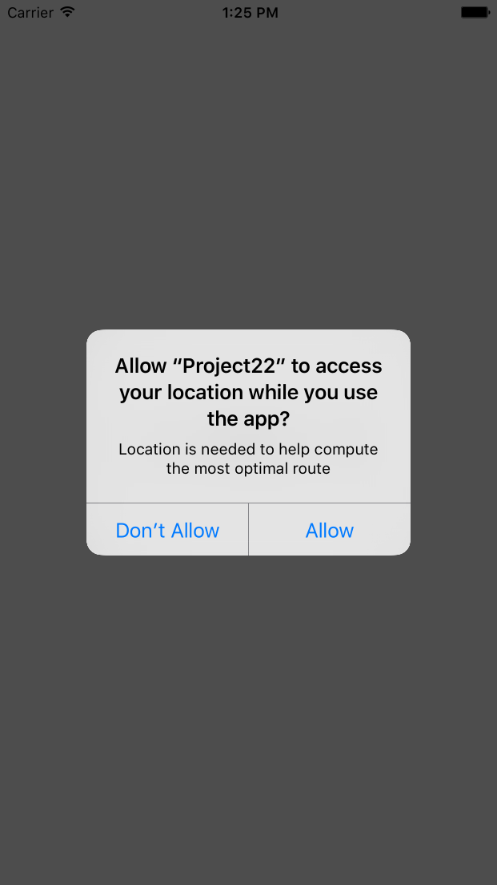
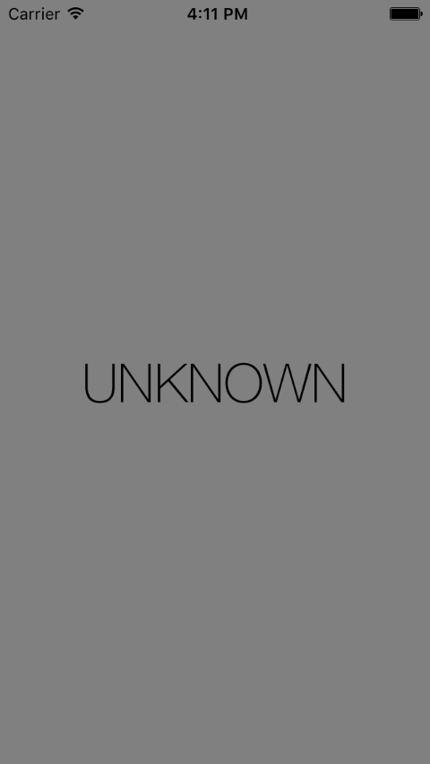

# DetectABeacon
Repo follows Project 22: Detect-a-Beacon with CLLocationManager and CLBeaconRegion

Requests user permission to allow use of their location for the app. Using proximity to beacons, the UI will change color and the text will change accordingly.




## Concepts learned/practiced
* Core Location
  * ```CLLocationManager``` class
    * Allows configuration of how we want to be notified about location as well as delivering location updates to us.
    * Request authorization with either ```requestAlwaysAuthorization()``` or ```requestWhenInUseAuthorization()``` method
  * ```CLBeaconRegion``` class - used to uniquely identify beacon
  * ```startMonitoringForRegion()``` method - monitors for existence of beacon region
  * ```startRangingBeaconsInRegion()``` method - measures distance between region and beacon
* iBeacons
  * Three things needed to ID iBeacons:
    * Universally unique identifier(UUID)
    * Major number(number between 1 and 65535)
    * Minor number
* More use of trailing closure syntax
* Switch statements for different cases of beacon proximity.

## Attributions
[Project 22: Detect-a-Beacon @ hackingwithswift.com](https://www.hackingwithswift.com/read/22/overview)
